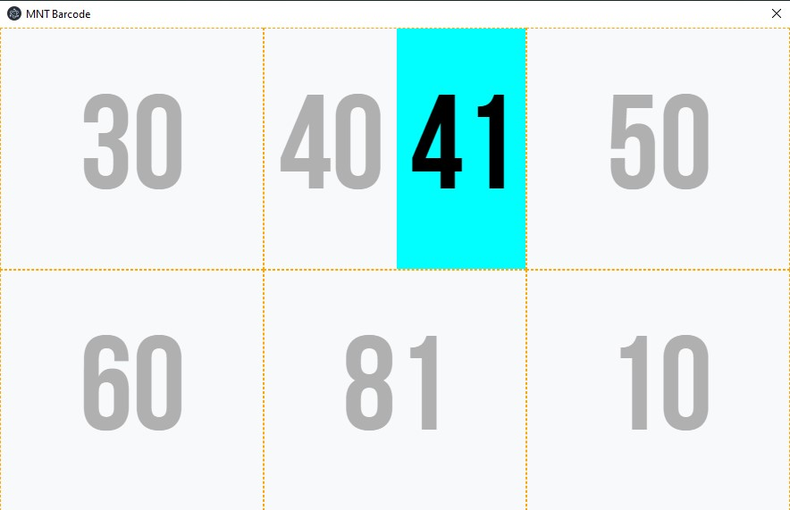
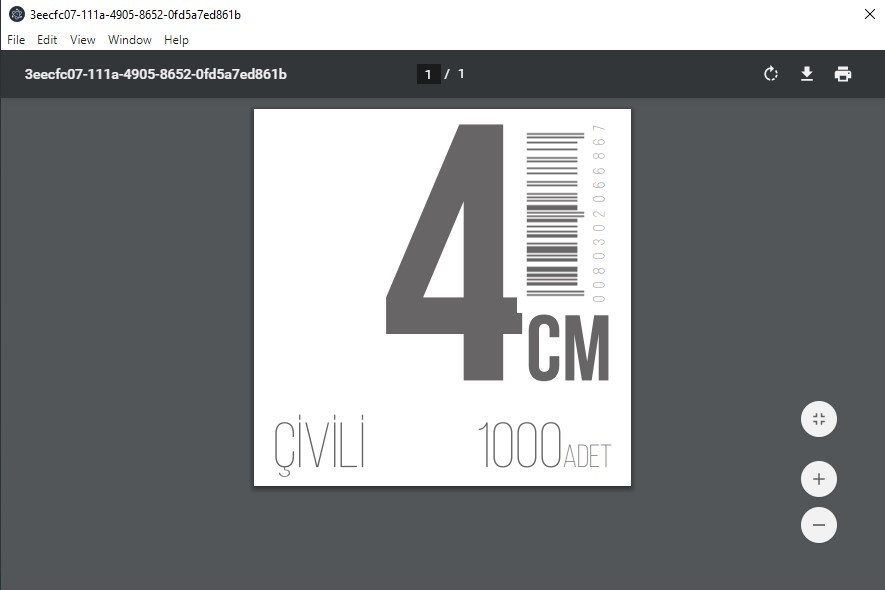

# mnt-barkod

**Mantolama dübel etketi basım uygulaması**

[FixPro](https://www.fixpro.com.tr) mantolama dübelleri için etiket basmaya yarayan, [electron](), [vue](), [jspdf]() den oluşan masaüstü uygulaması.




## Kullanım

[Git](https://git-scm.com) ve [Node.js](https://nodejs.org/en/download/) yüklü bilgisayarınızdan aşağıdaki komutları sırasıyla kullanabilirsiniz:

```bash
# Repoyu indirin
git clone https://github.com/alialaca/mnt-barkod
# Proje dizinine gidin
cd mnt-barkod
# Bağımlılıkları yükleyin
npm install
# Çalıştırın
npm start
```

